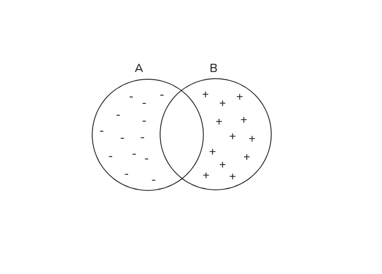
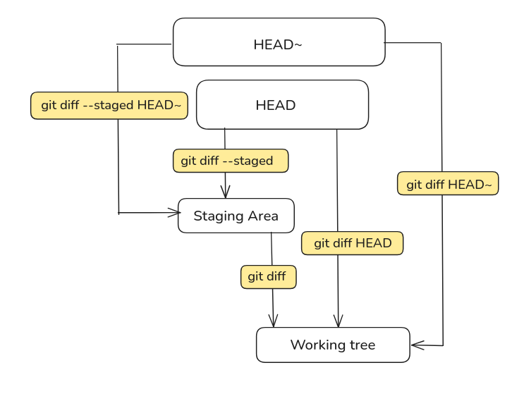

### what does `diff A B` mean ?

Think of `A` and `B` as two text files. `diff A B` shows what changes are needed to turn `A` into `B`.

`-` lines  represent content that exists in`A` but needs to be removed to transform `A` into `B`.
In other words, these lines are present in `A` but absent in `B`.

`+` lines represent content that does't exist in `A` and needs to be added to transform `A` into `B`.
In other words, these lines are present in `B` but absent in `A`.

<div align="left">
  
</div>


git diff works the same but A and B don’t have to be files on disk they can be commits, branches, the staging area or the working directory 
While the foundational concept of transforming `A` into `B` remains true, `git diff` rarely requires you to specify both explicitly. Git applies smart defaults to compare specific areas of your project.


- **Command:** `git diff`
- **A (Start Point):** The Staging Area
- **B (End Point):** The Working Directory
- **Compares**: Staging Area → Working Directory
- **Shows:**  Changes not yet staged
- **Question it answers:**  What have I changed since my last `git add`?

- **Command:** `git diff --staged` (or `git diff --cached`)
- **A (Start Point):** HEAD
- **B (End Point):** The Staging Area
- **Compares**: HEAD → The Staging Area
- **Shows:** The staged changes ready for commit
- **Question it answers:** What changes am I about to commit?

- **Command:** `git diff HEAD`
- **A (Start Point):** HEAD
- **B (End Point):** The Working Directory
- **Compares**: HEAD → Working Directory
- **Shows:** All changes (both staged and unstaged) since the last commit
- **Question it answers:** How is my file on disk different from the last commit snapshot?


<div align="left">
  
</div>


# `git diff A B` vs `A..B` vs `A...B`

`git diff A..B` is equivalent to `git diff A B`—both show the changes needed to transform `A` into `B`.

`git diff A...B` is equivalent to `git diff $(git merge-base A B) B`.
This compares the **common ancestor** of `A` and `B` with `B`, showing only the changes that happened on `B` since it diverged from `A`.

```
      C---D---E  (main)
     /
A---B
     \
      F---G---H  (feature-branch)
```

**Comparing `main` and `feature-branch`:**

- `git diff main...feature-branch` → compares `B` (merge-base) with `H` (tip of feature-branch)
    - Shows **only** changes `F`, `G`, `H` (work done on feature-branch)
    - The three-dot syntax is especially useful when reviewing a feature branch
    
- `git diff main..feature-branch` → compares `E` (tip of main) with `H` (tip of feature-branch)
    - Shows all differences between both branches


# `git show` 

Displays detailed information about a Git object (typically a commit), including:
- Commit metadata (hash, author, date, message)
- The changes (diff) introduced by that commit

#### The Diff Behind `git show`
The diff portion of `git show` works by comparing a commit with its parent:
- `git show HEAD` shows the diff: `HEAD^ → HEAD`
- `git show <commit-hash>` shows the diff: `<commit-hash>^ → <commit-hash>`

```sh
git show
# ↓ Defaults to HEAD
git show HEAD
# ↓ Under the hood, compares parent to HEAD
git diff HEAD^ HEAD

# For a specific commit:
git show abc1234
# ↓ Equivalent to:
git diff abc1234^ abc1234
```

# Useful Flags

```sh
# Ignore whitespace changes when comparing lines
git diff -w

# Show a compact summary of changes (files changed, insertions, deletions)
git diff --stat

# Show differences word-by-word instead of line-by-line
git diff --word-diff

# Show the diff in reverse (swap A and B)
git diff -R
```
