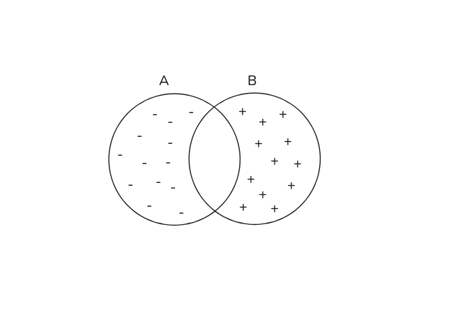
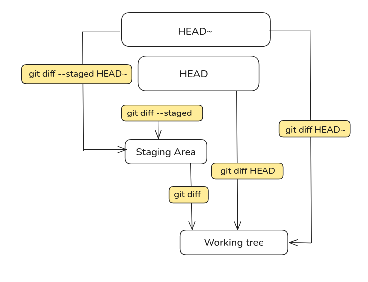

these days which codes are written by Agents 
i think its good to have review skills and just read the codes which is generated
so  i think knowing git diff well is very handy

## what does `diff A B` mean ?

Think of `A` and `B` as two text files. `diff A B` shows the changes are needed to turn `A` into `B`. (`A -> B`)

`-` lines exist in `A` but need to be removed to transform `A` into `B`. They are in `A` and not in `B`.

`+` lines don't exist in `A` and need to be added to transform `A` into `B`. They are in `B` and not in `A`.



That is the whole concept. `A` is where you start, `B` is where you end up, and the diff describes how to get from `A` to `B`.
You can test this concept right now without a Git repository. Git can diff any two plain files on your system:

```sh
git diff --no-index a.txt b.txt
```

No repo, no commits, no staging area. Just `A` and `B`.

## Reading a diff
...

## The defaults

In real daily usage, `A` and `B` are rarely physical files on disk. They represent states in your repository: commits, branches, the staging area, or your working directory.
The `A -> B` concept remains you rarely need to type both targets because Git infers them using smart defaults.

### `git diff`

- **A (start):** the staging area
- **B (end):** the working directory
- **Compares:** staging area -> working directory
- **Shows:** changes not yet staged
- **Question it answers:** what have i changed since my last `git add`?

### `git diff --staged` (or `git diff --cached`)

- **A (start):** HEAD
- **B (end):** the staging area
- **Compares:** HEAD -> staging area
- **Shows:** the staged changes ready for commit
- **Question it answers:** what changes am i about to commit?

### `git diff HEAD`

- **A (start):** HEAD
- **B (end):** the working directory
- **Compares:** HEAD -> working directory
- **Shows:** all changes (both staged and unstaged) since the last commit
- **Question it answers:** how is my working tree different from my last commit?





## `git diff A B` vs `A..B` vs `A...B`

`git diff A..B` is equivalent to `git diff A B`—both show the changes needed to transform `A` into `B`.

`git diff A...B` is equivalent to `git diff $(git merge-base A B) B`.
This compares the **common ancestor** of `A` and `B` with `B`, showing only the changes that happened on `B` since it diverged from `A`.

```
      C---D---E  (main)
     /
A---B
     \
      F---G---H  (feature-branch)
```

**Comparing `main` and `feature-branch`:**

- `git diff main...feature-branch` → compares `B` (merge-base) with `H` (tip of feature-branch)
    - Shows **only** changes `F`, `G`, `H` (work done on feature-branch)
    - The three-dot syntax is especially useful when reviewing a feature branch

- `git diff main..feature-branch` → compares `E` (tip of main) with `H` (tip of feature-branch)
    - Shows all differences between both branches


## `git show`

Displays detailed information about a Git object (typically a commit), including:
- Commit metadata (hash, author, date, message)
- The changes (diff) introduced by that commit

### The Diff Behind `git show`

The diff portion of `git show` works by comparing a commit with its parent:
- `git show HEAD` shows the diff: `HEAD^ → HEAD`
- `git show <commit-hash>` shows the diff: `<commit-hash>^ → <commit-hash>`

```sh
git show
# ↓ Defaults to HEAD
git show HEAD
# ↓ Under the hood, compares parent to HEAD
git diff HEAD^ HEAD

# For a specific commit:
git show abc1234
# ↓ Equivalent to:
git diff abc1234^ abc1234
```

## Useful Flags

```sh
# Ignore whitespace changes when comparing lines
git diff -w

# Show a compact summary of changes (files changed, insertions, deletions)
git diff --stat

# Show differences word-by-word instead of line-by-line
git diff --word-diff

# Show the diff in reverse (swap A and B)
git diff -R
```
