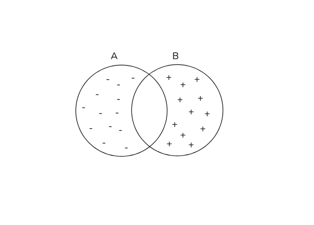
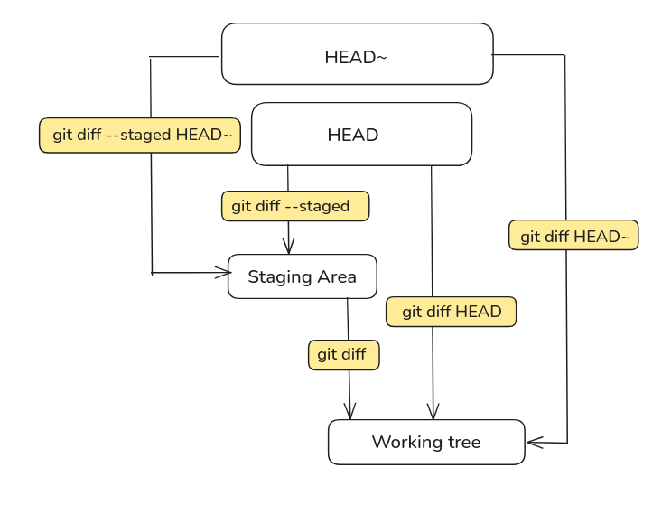

Your agents write the code now? At least review what they hand you. Reviewing means reading a diff, so let's see what a `diff` actually is.

## What does `diff A B` mean?

Think of `A` and `B` as two files. `diff A B` shows what changes are needed to turn `A` into `B` (`A -> B`).
- `-` lines exist in `A` but need to be removed to transform `A` into `B`. They are in `A` and not in `B`.
- `+` lines don't exist in `A` and need to be added to transform `A` into `B`. They are in `B` and not in `A`.



That is the whole concept. `A` is where you start, `B` is where you end up, and the diff describes how to get from `A` to `B`.

## The defaults

In everyday use `A` and `B` are rarely physical files on disk. They represent states in your repository such as commits, branches, the staging area, or your working directory.
The `A -> B` concept remains but you rarely need to specify both sides explicitly because Git infers them using smart defaults.

### `git diff`

- **A (start):** the staging area
- **B (end):** the working directory
- **Transform:** staging area -> working directory
- **Shows:** changes not yet staged
- **Question it answers:** what have I changed since my last `git add`?

### `git diff --staged` (or `git diff --cached`)

- **A (start):** HEAD
- **B (end):** the staging area
- **Transform:** HEAD -> staging area
- **Shows:** the staged changes ready for commit
- **Question it answers:** what changes am I about to commit?

### `git diff HEAD`

- **A (start):** HEAD
- **B (end):** the working directory
- **Transform:** HEAD -> working directory
- **Shows:** all changes (both staged and unstaged) since the last commit
- **Question it answers:** how is my working tree different from my last commit?





## `git diff A B` vs `A..B` vs `A...B`

`git diff A..B` is equivalent to `git diff A B`. Both show the changes needed to transform `A` into `B`.

`git diff A...B` is equivalent to `git diff $(git merge-base A B) B`.
It compares the **common ancestor** of `A` and `B` with `B`, showing only the changes made on `B` since it branched off from `A`.

**Comparing `main` and `feature`:**

```text
       c3---c4---c5  (main)
      /
c1---c2
      \
       f1---f2---f3  (feature)
```

- `git diff main...feature` -> compares `c2` (the merge-base) with `f3` (tip of feature)
    - Shows **only** the work done on the feature branch: `f3`, `f2`, `f1`
    - This is usually what you want when reviewing a branch, because it ignores whatever landed on `main` in the meantime
- `git diff main..feature` -> compares `c5` (tip of main) with `f3` (tip of feature)
    - Shows all differences between both branches


## `git show`

`git show` gives you a commit: the metadata (hash, author, date, message) plus the
diff it introduced.

That diff is nothing new. It's `A -> B` again, Git just picks `A` for you: the **parent**.

```sh
git show abc1234
# ↓ under the hood
git diff abc1234^ abc1234

# no argument? defaults to HEAD
git show
# ↓
git show HEAD
# ↓ under the hood
git diff HEAD^ HEAD
```

## Useful flags

```sh
# ignore whitespaces
git diff -w

# compact summary of changes (files changed, insertions, deletions)
git diff --stat

# show only the names of changed files
git diff --name-only

# word-by-word instead of line-by-line
git diff --word-diff

# swap A and B
git diff -R

# only this file
git diff -- main.go
```
